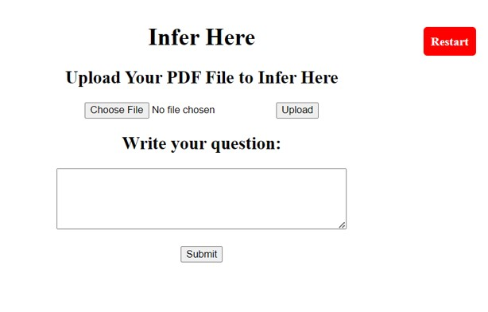

# AI-Powered Insurance Document Inference and Knowledge Retrieval System

## Background 

In my previous role, I spearheaded the development and successful launch of a Q&A product within the company's enterprise offerings. This product is an Demo Product, an end-to-end inference solution, seamlessly integrated Elasticsearch with BM25 Retriever to enhance context ranking capabilities. By optimizing Language Models such as BERT and RoBERTa through fine-tuning on a tailored insurance dataset in Squad 2.0 format, we achieved exceptional accuracy rates of 93% on 16 paragraph context fields and 95% on 8 key pair entity fields prediction. This experience underscores my proficiency in leveraging advanced technologies to deliver impactful solutions.

## Overview

This is an end-to-end Question & Answering (Q&A) Module. The module is an integral part of Natural Language Processing (NLP) systems, enabling computers to understand and respond to questions in human language. It involves various steps such as tokenization, model selection, contextual understanding, answer prediction, and response formatting.

The focus of this Q&A Module is to utilize pre-trained language models like BERT, GPT, etc., for comprehending context and providing accurate answers. The project distinguishes between closed-domain (specific domain) and open-domain (general knowledge) QA systems, highlighting their respective characteristics.

## Project Structure

### **Introduction to Question & Answer Module**
- **Intro**: The Q&A Module, an integral component of NLP systems, empowers computers to comprehend and respond to human language questions. It processes textual input, involving steps like tokenization, model selection, contextual understanding, answer prediction, and response formatting. By leveraging pre-trained language models such as BERT and GPT, the module efficiently understands context and generates accurate responses. Q&A systems can be categorized into closed-domain, specific to a certain domain, and open-domain, covering general knowledge.

### **Closed Domain VS Open Domain Q&A**

- **Objective**: Understand the differences between closed-domain and open-domain Q&A systems.

Closed-domain Q&A systems focus on specific topics, ensuring higher accuracy within their designated domain, often predefined for tasks like customer support. In contrast, open-domain Q&A systems cover a broad spectrum of topics and general knowledge, offering the ability to answer a wider range of questions. However, they may have lower accuracy due to the vast contextual diversity, making them suitable for general information queries and exploratory searches.

### **Q&A Module Demand in Insurance Sector**

- **Objective**: Explore applications of Q&A modules in the insurance sector.

  - Complex policies and information: QA helps explain intricate insurance terms and policies.
  - Customer support efficiency: QA reduces customer service load by providing quick answers.
  - Claim process guidance: QA offers step-by-step assistance during claim procedures.
  - Policy recommendations: QA suggests suitable insurance policies based on customer needs.
  - Training and onboarding: QA aids in training agents and employees with quick answers.
  - Accessibility: Customers can access answers 24/7, improving user experience.
  - Automating tasks: QA handles routine tasks like policy documents and billing inquiries.
  - Data-driven insights: QA analysis identifies trends and areas for service improvement.
  - Multilingual support: QA assists in various languages for better communication.
  - Fraud detection: QA can aid in fraud detection during claims

### 3. **Heystack Framework**

- **Objective**: Introduce the Heystack framework for building end-to-end QA systems.

Heystack, an open-source framework, facilitates the development of comprehensive end-to-end QA systems. By seamlessly integrating retrievers, readers, and a document store, it forms a robust QA pipeline. The framework supports various components and allows customization for diverse use cases. With its inclusive approach, Heystack provides an efficient question-answering solution, empowering developers to create powerful QA systems tailored to specific domains and applications.

### 4. **Introduction to LLM’s**

- **Objective**: Provide an overview of Large Language Models (LLMs) used in the project.

LLMs, or Large Language Models, represent advanced AI systems engineered to understand and generate human language. Constructed on neural network architectures inspired by the human brain's structure, these models excel at processing and comprehending text, enabling diverse language-related tasks. Their capabilities extend to handling extensive data volumes and learning intricate linguistic patterns. Examples of LLMs include BERT, ROBERTA, GPT, and more. These models find application in various use cases, such as Question Answering, Sentiment Analysis, Text Generation, and beyond.

### 5. **Q&A Module Flow**

- **Objective**: Explains the main modules in the Q&A product, including Digitization, Document Store, Prediction, Training, and User Interface.

## Digitization Module [digitization file](./text_digitization.py)

- **Objective**: Describe the process of converting PDF files to text using the TIKA library.

This module accepts a PDF file as input and produces a text file as output. To perform the conversion from PDF to text, the module leverages the TIKA Library. Developed by The Apache Software Foundation, Apache Tika is an open-source content analysis and detection toolset. The flexible TIKA library proves to be a valuable resource for text analysis and content processing applications, simplifying the extraction of text and information from PDF files. The process involves using the "parser.from_file(pdf)" method, which parses and extracts content, including text and metadata, from the specified PDF file.

## Document Store Module [document store file](./document_store.py)

- **Objective**: Explains the use of Elasticsearch as a document store for efficient data storage and retrieval.

The Document Store Module employs Elastic Search, a robust and open-source search and analytics engine, for efficient storage, retrieval, and querying of structured or semi-structured documents. Elasticsearch stands out for its quick indexing, full-text search capabilities, scalability, and support for sophisticated queries and filters. Well-suited for text-based and information retrieval applications, Elasticsearch excels in managing significant amounts of text data. This choice is made after comparing various document stores, including ElasticsearchDocumentStore, SQLDocumentStore, InMemoryDocumentStore, FaissDocumentStore, and MilvusDocumentStore.

## Prediction Pipeline [Prediction Pipeline](./Prediction_main.py)

### Retriever
- A crucial component in the Q&A Module, the Retriever quickly narrows down potential paragraphs containing answers to a query.
- Utilizes a faster and simpler method than the comprehensive Reader, improving overall question-answering efficiency.
- Reduces the workload for subsequent resource-intensive pipeline steps.

### BM25Retriever
- A specific Retriever component in the Haystack framework, employing the BM25 algorithm for information retrieval.
- BM25 (Best Matching 25) is a widely-used ranking function in search engines.
- Focuses on selecting paragraphs likely to contain relevant information based on a query.
- Calculates relevance scores using the BM25 algorithm, with internal use of Cosine Similarity.

### Reader
- A vital component in the Q&A Module, the Reader extracts precise answers from paragraphs retrieved by the Retriever.
- Responsible for understanding the context of the question and retrieved documents to pinpoint relevant answers.
- Utilizes pre-trained language models like BERT, RoBERTa, or similar architectures.

### Roberta-base-squad2-distilled
- The distilled variant of the RoBERTa model, specifically designed for the question-answering task.
- Trained on the SQuAD 2.0 dataset, enhancing question-answering performance.
- Involves knowledge transfer from a teacher model to a smaller student model.
- Improves efficiency and speed while maintaining an accuracy rate of 83.9%.

### Prediction Pipeline Architecture
- Commonly used in question-answering systems, this architecture combines Retriever and Reader strengths for accurate and contextually relevant answers.
- Configured with parameters controlling the number of paragraphs retrieved and considered for answer extraction.
- Retriever parameter "top_k" set to 10, indicating retrieval of the top 10 relevant paragraphs.
- Reader parameter "top_k" set to 5, indicating consideration of the top 5 retrieved paragraphs for answer extraction.

## Training Module || Dataset

### SQUAD 2.0 Format Dataset
- Stanford Question Answering Dataset (SQuAD), a benchmark dataset in NLP fields, created by Stanford University in 2016.
- Used for testing NLP algorithms' question-answering abilities.
- Crucial for assessing and enhancing question-answering systems.
- Evaluates machine learning models' comprehension and response to text-based questions.
- Built with contributions from the public, ensuring a diverse range of natural language material.

### Squad Dataset Format View

## Training Module [Training File](./transfer_learning_qa.py)

### Heystack Annotation
- For annotating and creating a customized SQUAD 2.0 Format dataset from insurance domain-specific documents, Heystack Annotation tools are used.
- Link: [Heystack Annotation Tool](https://annotate.deepset.ai/projects/9250)
- Dataset Labeling: Annotators mark relevant information, including passages, phrases, and context.
- Customizable Interface: Interface tailored to project and dataset needs.
- Data Export: Annotated data can be exported in the required SQUAD 2.0 format JSON.

### Heystack Annotation Tool Interface

### Model Comparison Experiment Results
- The table shows the results of experiments where we applied a prediction layer to distill a fine-tuned large model (~350M parameters) into a base model (~115M parameters and ~2x the speed of a large model).

### Model Fine Tuning || Transfer Learning
- Transfer learning involves using knowledge gained from solving one problem to help solve a different but related problem.
- Utilizes pre-trained models on one task for another task, saving time and resources by leveraging pre-existing knowledge.
- Fine-tuning involves adjusting pre-trained model parameters for a new task, enabling models to achieve good performance with smaller datasets.

### Result

## PRODUCT FLOW

- **Objective**: Provided a visual representation of the user interface and key features of the Q&A product.
- User interface view:
 - Key Features:
  - Choose File: Click to upload pdf file for inferring
  - Upload: Click after choosing required file for inferring to upload.
  - Restart: Click for restarting application.
  

## PRODUCT PREDICTION

### 16. **TESTING REPORT**

- **Objective**: Presenting the testing results, including accuracy and processing time for different models.

### 17. **Future Improvements**

- **Objective**: Outline potential improvements for the future, including collecting more domain-specific data and handling various file formats.

## Usage

1. **Closed Domain VS Open Domain Q&A**: Understand the distinctions between closed and open-domain Q&A.
2. **Q&A Module Demand in Insurance Sector**: Explore applications of the Q&A module in the insurance sector.
3. **Heystack Framework**: Learn about the open-source framework for building QA systems.
4. **Introduction to LLM’s**: Gain an overview of Large Language Models.
5. **Q&A Module Flow**: Understand the main modules in the Q&A product.
6. **Digitization Module**: Convert PDF files to text using the TIKA library.
7. **Document Store Module**: Utilize Elasticsearch for efficient data storage and retrieval.
8. **Prediction Module || Retriever**: Understand the Retriever component, especially BM25Retriever.
9. **Prediction Module || Reader**: Explore the crucial Reader component for extracting answers.
10. **Prediction Module || Prediction Pipeline**: Comprehend the architecture of the prediction pipeline.
11. **Training Module || Dataset**: Use the SQUAD 2.0 format dataset for training.
12. **Training Module || Annotation**: Create a customized dataset using Heystack Annotation tools.
13. **Training Module || Model Comparison**: Examine the results of model experiments.
14. **Training Module || Model Fine Tuning**: Understand transfer learning and fine-tuning.
15. **PRODUCT FLOW**: Visualize the user interface and key features.
16. **TESTING REPORT**: Review testing results, accuracy, and processing time.
17. **Future Improvements**: Explore potential enhancements for the future.

## Requirements

- Python 3.x
- Libraries: farm, fastapi, flask, tika, uvicorn, flask_sqlalchemy, pandas, psycopg2-binary, scikit-learn, elasticsearch, elasticsearch-dsl

## Conclusion

The Q&A Module project provides a comprehensive solution for natural language question answering, particularly in the insurance sector. By combining advanced language models, a robust framework, and thorough training and evaluation processes, the project aims to improve user experience, efficiency, and accuracy in retrieving information. Future improvements are outlined to enhance the model's accuracy and versatility.

Thank you for exploring the AI-Powered Insurance Document Inference and Knowledge Retrieval System developed by Manoj Kumar Thota!
